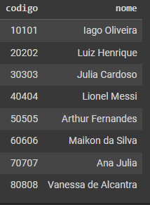
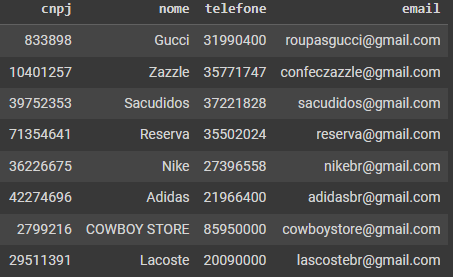
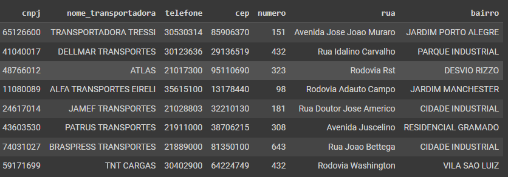
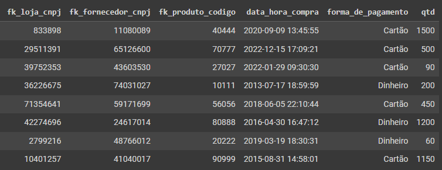
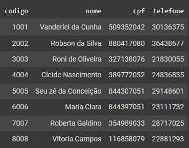
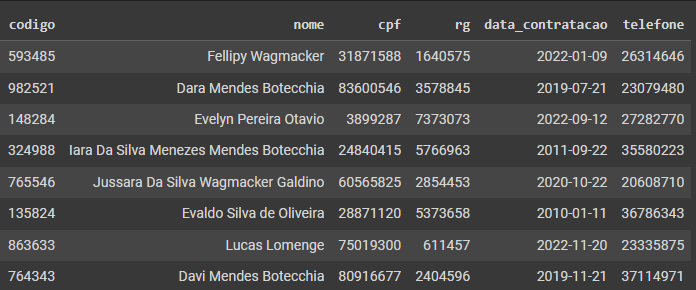
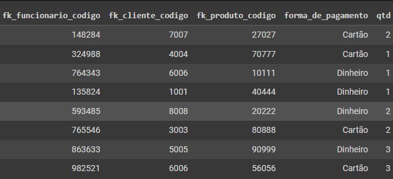

# TRABALHO 01:  Título do Trabalho
Trabalho desenvolvido durante a disciplina de Banco de dados

# Sumário

### 1. COMPONENTES 
Integrantes do grupo 
primeiro_componente_do_grupo:fellipywagmacker123@gmail.com 
segundo_componente_do_grupo:dara.botecchia22@gmail.com 
terceiro_componente_do_grupo:evelynpo59@gmail.com 

### 2.INTRODUÇÃO E MOTIVAÇÃO 
Este documento contém a especificação do projeto do banco de dados <nome do projeto> 
 e motivação da escolha realizada.  

> A loja visa colaborar com o desenvolvimento socioprofissional dos seus colaboradores e acima da venda de produtos, entregar experiências diferenciadas para o seu público alvo. O sistema da loja tem como objetivo gerenciar todos os processos da organização, bem como controlar e gerar relatórios analíticos. Para que seja efetuado tal gerenciamento é realizado o cadastro de  pessoa física como por exemplo: cliente, funcionário, compra, produto e Pessoa jurídica: loja, fornecedores, compra, produto. De acordo com o gerenciamento nada sai e entra da loja sem que seja processado pelo sistema, desde mercadorias, valores, impostos, folhas de pagamento, aquisição de bens, investimentos, receita e despesas. O sistema promove uma gestão mais assertiva e confiável.
 

### 3.MINI-MUNDO 

Descrever o mini-mundo! (Não deve ser maior do que 30 linhas, se necessário resumir para justar)  
Entrevista com o usuário e identificação dos requisitos.(quando for o caso de sistemas com cliente  real) 
Descrição textual das regras de negócio definidas como um  subconjunto do mundo real 
cujos elementos são propriedades que desejamos incluir, processar, armazenar, 
gerenciar, atualizar, e que descrevem a proposta/solução a ser desenvolvida.

> Um sistema gerencia várias LOJAS, para uma melhor organização foram distribuídos dados de PESSOA FISICA e PESSOA JURIDICA. Portanto, em PESSOA FISICA foram armazenados as informações das seguintes entidades: CLIENTE ( codigo, nome, cpf, telefone), FUNCIONARIO ( codigo, nome, cpf, rg, data_de_contratacao, telefone), associados ao o relacionamento COMPRA ( data_hora_compra, quantidade) e conectado a entidade PRODUTO( marca, preco, codigo). Portanto, um cliente pode comprar um ou vários produtos e o funcionário pode vender um ou vários produtos para os clientes. Seguimos agora com as informações armazenadas em PESSOA JURIDICA com as seguintes entidades: LOJA ( CNPJ, nome, telefone, email), FORNECEDOR (CNPJ, nome_transportadora, endereço, telefone), associados ao o relacionamento FORNECER ( data_hora_compra, forma_de_pagamento, quantidade) e conectado a entidade PRODUTO( marca, preco, codigo). Sendo assim, uma loja pode ter um ou vários fornecedores e os fornecedores podem fornecer para uma ou várias lojas, podendo comprar um ou vários produtos. 

   

### 4.PERGUNTAS A SEREM RESPONDIDAS E TABELA DE DADOS 
#### 4.1 QUAIS PERGUNTAS PODEM SER RESPONDIDAS COM O SISTEMA PROPOSTO?
    a) O sistema proposto poderá fornecer quais tipos de relatórios e informaçes? 
    
    Além de gerenciar todos os processos realizados na empresa o sistema irá gerar relatórios analíticos, trazendo informações  de Pessoa física, Pessoa jurídica, dados de seus produtos e informações sobre vendas realizadas. Portanto, o sistema proposto contribui com a organização e armazenagem de informações da empresa.
    
    b) Crie uma lista com os 5 principais relatórios que poderão ser obtidos por meio do sistema proposto!
    
. Pessoa, sendo ela física ou jurídica. 
. Loja: CNPJ, nome, telefone, email. 
. Dados de seus funcionários: Código, nome, cpf, data de contratação, telefone. 
. Informações de seus fornecedores: CNPJ, nome da transportadora, endereço, telefone. 
. Relatórios de vendas realizadas pelas lojas: Data e hora da compra, forma de pagamento, produto. 

    

 ### 5.MODELO CONCEITUAL 
       

    
       
#### 5.1 Validação do Modelo Conceitual
    [Grupo01]: [ ]
    [Grupo02]: [ ]

#### 5.2 Descrição dos dados 
    
Pessoa: Entidade na qual contém uma associação entre Pessoa Física e Pessoa Jurídica. 
Pessoa Física: Inclui informações sobre cliente e funcionário.  
Pessoa Jurídica: Inclui informações sobre Loja e Fornecedor. 
Cliente: Campo que abrange dados sobre os clientes cadastrados. 
Funcionário: Campo que abrange dados sobre os funcionários. 
Compra: Contém dados sobre as compras realizadas. 
Produto: Dados sobre os produtos. 
Loja: Inclui informações sobre a loja. 
Fornecedor: Campo que armazena informações sobre os fornecedores. 

### 6 MODELO LÓGICO 

### 7 MODELO FÍSICO 
	
CREATE TABLE PESSOA(
codigo integer PRIMARY KEY,
nome varchar(80)
);

--------------------------------------------------------------------------------------------------------------------------------------------------------
	
CREATE TABLE LOJA(
cnpj integer PRIMARY KEY,
nome varchar(150),
telefone integer,
email varchar(150)
);
  
--------------------------------------------------------------------------------------------------------------------------------------------------------
	
CREATE TABLE FORNECEDOR(
cnpj integer PRIMARY KEY,
nome_transportadora varchar(100),
telefone integer,
cep integer,
numero integer,
rua varchar(25),
bairro varchar(30)
);
	
--------------------------------------------------------------------------------------------------------------------------------------------------------
	
CREATE TABLE FUNCIONARIO(
codigo integer PRIMARY KEY,
nome varchar(170),
cpf integer,
rg integer,
data_contratacao date,
telefone integer
);

--------------------------------------------------------------------------------------------------------------------------------------------------------
	
CREATE TABLE CLIENTE(
codigo integer PRIMARY KEY,
nome varchar(80),
cpf integer,
telefone integer
)
	
--------------------------------------------------------------------------------------------------------------------------------------------------------
	
CREATE TABLE PRODUTO(
codigo integer PRIMARY KEY,
marca varchar(70),
preco float
);
	
--------------------------------------------------------------------------------------------------------------------------------------------------------
	
CREATE TABLE LOJA_FORNECEDOR( 
FK_LOJA_cnpj integer, 
FK_FORNECEDOR_cnpj integer, 
FK_PRODUTO_codigo integer,
FK_PESSOA_codigo integer,
data_hora_compra timestamp, 
forma_de_pagamento varchar(20), 
qtd integer,

FOREIGN KEY(FK_LOJA_cnpj) REFERENCES LOJA(cnpj), 
FOREIGN KEY(FK_FORNECEDOR_cnpj) REFERENCES FORNECEDOR(cnpj), 
FOREIGN KEY(FK_PRODUTO_codigo) REFERENCES PRODUTO(codigo),
FOREIGN KEY(FK_PESSOA_codigo) REFERENCES PESSOA(codigo)
);	
--------------------------------------------------------------------------------------------------------------------------------------------------------
	
CREATE TABLE CLIENTE_FUNCIONARIO(
FK_FUNCIONARIO_codigo integer,
FK_CLIENTE_codigo integer,
FK_PRODUTO_codigo integer,
FK_PESSOA_codigo integer,
forma_de_pagamento varchar(20),
qtd integer,

FOREIGN KEY (FK_FUNCIONARIO_codigo)
REFERENCES FUNCIONARIO(codigo),
FOREIGN KEY (FK_CLIENTE_codigo)
REFERENCES CLIENTE(codigo),
FOREIGN KEY (FK_PRODUTO_codigo)
REFERENCES PRODUTO(codigo),
FOREIGN KEY (FK_PESSOA_CODIGO)
REFERENCES PESSOA(codigo)
);

       
### 8	INSERT APLICADO NAS TABELAS DO BANCO DE DADOS 
INSERT INTO PESSOA(codigo, nome)
VALUES(010101, 'Iago Oliveira'),
      (020202, 'Luiz Henrique'),
      (030303, 'Julia Cardoso'),
      (040404, 'Lionel Messi'),
      (050505, 'Arthur Fernandes'),
      (060606, 'Maikon da Silva'),
      (070707, 'Ana Julia'),
      (080808, 'Vanessa de Alcantra');
SELECT * FROM PESSOA;
	
--------------------------------------------------------------------------------------------------------------------------------------------------------
	
INSERT INTO LOJA(cnpj, nome, telefone, email)
VALUES(833898, 'Gucci', 31990400, 'roupasgucci@gmail.com'),
      (10401257, 'Zazzle', 35771747, 'confeczazzle@gmail.com'),
      (39752353, 'Sacudidos', 37221828, 'sacudidos@gmail.com'),
      (71354641, 'Reserva', 35502024, 'reserva@gmail.com'),
      (36226675, 'Nike', 27396558, 'nikebr@gmail.com'),
      (42274696, 'Adidas', 21966400, 'adidasbr@gmail.com'),
      (2799216, 'COWBOY STORE', 85950000, 'cowboystore@gmail.com'),
      (29511391, 'Lacoste', 20090000, 'lascostebr@gmail.com'); 
SELECT * FROM LOJA;
	
--------------------------------------------------------------------------------------------------------------------------------------------------------
	
INSERT INTO FORNECEDOR(cnpj, nome_transportadora, telefone, cep, numero, rua, bairro)
VALUES(65126600, 'TRANSPORTADORA TRESSI', 30530314, 85906370, 151, 'Avenida Jose Joao Muraro', 'JARDIM PORTO ALEGRE'),
   (41040017, 'DELLMAR TRANSPORTES', 30123636, 29136519, 432, 'Rua Idalino Carvalho', 'PARQUE INDUSTRIAL'),
      (48766012, 'ATLAS', 21017300, 95110690, 323, 'Rodovia Rst', 'DESVIO RIZZO'),
      (11080089, 'ALFA TRANSPORTES EIRELI', 35615100, 13178440, 098, 'Rodovia Adauto Campo', 'JARDIM MANCHESTER'),
      (24617014, 'JAMEF TRANSPORTES', 21028803, 32210130, 181, 'Rua Doutor Jose Americo', 'CIDADE INDUSTRIAL'),
      (43603530, 'PATRUS TRANSPORTES', 21911000, 38706215, 308, 'Avenida Juscelino', 'RESIDENCIAL GRAMADO'),
      (74031027, 'BRASPRESS TRANSPORTES', 21889000, 81350100, 643, 'Rua Joao Bettega', 'CIDADE INDUSTRIAL'),
      (59171699, 'TNT CARGAS', 30402900, 64224749, 432, 'Rodovia Washington', 'VILA SAO LUIZ');
SELECT * FROM FORNECEDOR;
	
--------------------------------------------------------------------------------------------------------------------------------------------------------
	
INSERT INTO FUNCIONARIO(codigo, nome, cpf, rg, data_contratacao, telefone)
VALUES(593485, 'Fellipy Wagmacker', 31871588, 1640575, '2022-01-09', 26314646),
      (982521, 'Dara Mendes Botecchia', 83600546, 3578845, '2019-07-21', 23079480),
      (148284, 'Evelyn Pereira Otavio', 03899287, 7373073, '2022-09-12', 27282770),
      (324988, 'Iara Da Silva Menezes Mendes Botecchia', 24840415, 5766963, '2011-09-22', 35580223),
      (765546, 'Jussara Da Silva Wagmacker Galdino', 60565825, 2854453, '2020-10-22', 20608710),
      (135824, 'Evaldo Silva de Oliveira', 28871120, 5373658, '2010-01-11', 36786343),
      (863633, 'Lucas Lomenge', 75019300, 0611457, '2022-11-20', 23335875),
      (764343, 'Davi Mendes Botecchia', 80916677, 2404596, '2019-11-21', 37114971);
SELECT * FROM FUNCIONARIO;
	
--------------------------------------------------------------------------------------------------------------------------------------------------------	
	
INSERT INTO CLIENTE(codigo, nome, cpf, telefone)
VALUES(01001, 'Vanderlei da Cunha', 509352042, 30136375),
     (02002, 'Robson da Silva', 880417080, 36438677),
     (03003, 'Roni de Oliveira', 327138076, 21830055),
     (04004, 'Cleide Nascimento', 389772052, 24836835),
     (05005, 'Seu zé da Conceição', 844307051, 29148601),
     (06006, 'Maria Clara', 844397051, 23111732),
     (07007, 'Roberta Galdino', 354989033, 28717025),
     (08008, 'Vitoria Campos', 116858079, 22881293);
 SELECT * FROM CLIENTE;
	
--------------------------------------------------------------------------------------------------------------------------------------------------------

INSERT INTO PRODUTO(codigo, marca, preco) 
VALUES(070777, 'Nike', 79.99), 
      (090999, 'Adidas', 129.99), 
      (040444,'Reserva', 99.99), 
      (020222, 'Nike', 55.50), 
      (056056, 'Nike', 100.50), 
      (027027, 'Zazzle', 349.99), 
      (010111, 'Zazzle', 259.99), 
      (080888, 'Nike', 199.99);
SELECT * FROM PRODUTO;
	
--------------------------------------------------------------------------------------------------------------------------------------------------------
	
INSERT INTO LOJA_FORNECEDOR(FK_LOJA_cnpj,FK_FORNECEDOR_cnpj, FK_PRODUTO_codigo, FK_PESSOA_codigo, data_hora_compra, forma_de_pagamento, qtd)
VALUES(833898, 11080089, 040444, 080808, '2020-09-09 13:45:55', 'Cartão', 1500),
      (29511391, 65126600, 070777, 030303, '2022-12-15 17:09:21', 'Cartão', 500),
      (39752353, 43603530, 027027, 060606, '2022-01-29 09:30:30', 'Cartão', 90),
      (36226675, 74031027, 010111, 010101, '2013-07-17 18:59:59', 'Dinheiro', 200),
      (71354641, 59171699, 056056, 070707, '2018-06-05 22:10:44', 'Cartão', 450),
      (42274696, 24617014, 080888, 050505, '2016-04-30 16:47:12', 'Dinheiro', 1200),
      (2799216, 48766012, 020222, 020202, '2019-03-19 18:30:31', 'Dinheiro', 60),
      (10401257, 41040017, 090999, 040404, '2015-08-31 14:58:01', 'Cartão', 1150);
SELECT * FROM loja_fornecedor;
	
--------------------------------------------------------------------------------------------------------------------------------------------------------
	
INSERT INTO CLIENTE_FUNCIONARIO(FK_FUNCIONARIO_codigo, FK_CLIENTE_codigo, FK_PRODUTO_codigo, FK_PESSOA_codigo, forma_de_pagamento, qtd)
VALUES(148284, 07007, 027027, 060606, 'Cartão', 2),
      (324988, 04004, 070777, 030303, 'Cartão', 1),
      (764343, 06006, 010111, 070707, 'Dinheiro', 1),
      (135824, 01001, 040444, 010101, 'Dinheiro', 1),
      (593485, 08008, 020222, 040404, 'Dinheiro', 2),
      (765546, 03003, 080888, 020202, 'Cartão', 2),
      (863633, 05005, 090999, 080808, 'Dinheiro', 3),
      (982521, 06006, 056056, 060606, 'Cartão', 3);
SELECT * FROM CLIENTE_FUNCIONARIO;	
	

### 9	TABELAS E PRINCIPAIS CONSULTAS 

TABELA PESSOA 
       
 
	
--------------------------------------------------------------------------------------------------------------------------------------------------------------
	
TABELA LOJA 
       
 
	
--------------------------------------------------------------------------------------------------------------------------------------------------------------
	
TABELA FORNECEDOR 
       
 
	
--------------------------------------------------------------------------------------------------------------------------------------------------------------

TABELA LOJA_FORNECEDOR 
       
 	
	
--------------------------------------------------------------------------------------------------------------------------------------------------------------	
TABELA CLIENTE 
       
 
	
--------------------------------------------------------------------------------------------------------------------------------------------------------------
	
TABELA FUNCIONARIO 
       
 ]
	
--------------------------------------------------------------------------------------------------------------------------------------------------------------
	
TABELA CLIENTE_FUNCIONARIO 
       
 
	
	
	
	

># Marco de Entrega 01: Do item 1 até o item 9.1 

#### 9.2 CONSULTAS DAS TABELAS COM FILTROS WHERE (Mínimo 4) 

SELECT * FROM FUNCIONARIO WHERE data_contratacao >= '2019-09-22'; 
	
--------------------------------------------------------------------------------------------------------------------------------------------------------------	

SELECT * FROM CLIENTE_FUNCIONARIO WHERE forma_de_pagamento = 'Cartão'; 
	
--------------------------------------------------------------------------------------------------------------------------------------------------------------

SELECT * FROM LOJA_FORNECEDOR WHERE forma_de_pagamento = 'Dinheiro' and qtd > 90; 
	
--------------------------------------------------------------------------------------------------------------------------------------------------------------	

SELECT * FROM PRODUTO where marca = 'Adidas' or preco < 150.00; 
	
--------------------------------------------------------------------------------------------------------------------------------------------------------------	

SELECT * FROM CLIENTE WHERE codigo < 6006 and nome like '%de%'; 
	
--------------------------------------------------------------------------------------------------------------------------------------------------------------
	
#### 9.3 CONSULTAS QUE USAM OPERADORES LÓGICOS, ARITMÉTICOS E TABELAS OU CAMPOS RENOMEADOS (Mínimo 11) 
a) Criar 5 consultas que envolvam os operadores lógicos AND, OR e Not 
	
SELECT * FROM fornecedor where nome_transportadora like '%D%' or rua like '%da%' 
	
--------------------------------------------------------------------------------------------------------------------------------------------------------------	

SELECT * FROM loja_fornecedor where fk_produto_codigo > 20222 and forma_de_pagamento = 'Dinheiro'; 

--------------------------------------------------------------------------------------------------------------------------------------------------------------	
	
SELECT * FROM LOJA WHERE nome like '%i%' and email like '%pa%'; 

--------------------------------------------------------------------------------------------------------------------------------------------------------------	
	
SELECT * FROM CLIENTE_FUNCIONARIO where fk_funcionario_codigo < 700000 or qtd = 1; 

--------------------------------------------------------------------------------------------------------------------------------------------------------------	
	
SELECT * FROM FUNCIONARIO where nome like '%Me%' or data_contratacao <= '2020-10-22'; 
	
--------------------------------------------------------------------------------------------------------------------------------------------------------------	
	
b) Criar no mínimo 3 consultas com operadores aritméticos 
	
SELECT preco - (preco*0.1) as "Preço com desconto de 10%" FROM PRODUTO

--------------------------------------------------------------------------------------------------------------------------------------------------------------	
	
SELECT qtd + (qtd * 360) as "Quantidade de produtos comprados em um ano" FROM LOJA_FORNECEDOR

--------------------------------------------------------------------------------------------------------------------------------------------------------------	
	
SELECT sum(qtd ) * count(fk_cliente_codigo) AS "Quantidade de produtos por cliente" FROM CLIENTE_FUNCIONARIO 
	
--------------------------------------------------------------------------------------------------------------------------------------------------------------	
	
c) Criar no mínimo 3 consultas com operação de renomear nomes de campos ou tabelas	
	
SELECT codigo AS cod_funcionario, nome AS nome_completo, data_contratacao AS data_contratacao_do_funcionario FROM FUNCIONARIO

--------------------------------------------------------------------------------------------------------------------------------------------------------------	
	
SELECT marca AS marca_do_produto, preco AS valor FROM PRODUTO

--------------------------------------------------------------------------------------------------------------------------------------------------------------	
	
SELECT codigo AS numero, nome AS nome_completo FROM CLIENTE
	
--------------------------------------------------------------------------------------------------------------------------------------------------------	
#### 9.4CONSULTAS QUE USAM OPERADORES LIKE E DATAS (Mínimo 12)  
a) Criar outras 5 consultas que envolvam like ou ilike

SELECT * FROM LOJA where nome like '%os%';

--------------------------------------------------------------------------------------------------------------------------------------------------------

SELECT * FROM fornecedor where nome_transportadora ilike 'T%';

--------------------------------------------------------------------------------------------------------------------------------------------------------

SELECT * FROM PRODUTO where marca like '%e';

--------------------------------------------------------------------------------------------------------------------------------------------------------

SELECT * FROM CLIENTE where nome ilike '%C%'

--------------------------------------------------------------------------------------------------------------------------------------------------------

SELECT * FROM FUNCIONARIO where nome like '%W%'

--------------------------------------------------------------------------------------------------------------------------------------------------------

SELECT * FROM PESSOA where nome like '%na%';

--------------------------------------------------------------------------------------------------------------------------------------------------------

SELECT * FROM FORNECEDOR where nome_transportadora ilike '%C%' or bairro like 'C%';

--------------------------------------------------------------------------------------------------------------------------------------------------------

SELECT * FROM PRODUTO where marca like 'Z%' or marca like '%s';

--------------------------------------------------------------------------------------------------------------------------------------------------------

SELECT * FROM FUNCIONARIO where nome ilike '%y%' or nome ilike 'e%';

--------------------------------------------------------------------------------------------------------------------------------------------------------

b) Criar uma consulta para cada tipo de função data apresentada.

SELECT current_date - (data_contratacao) as "dias_trabalhados" from FUNCIONARIO;

--------------------------------------------------------------------------------------------------------------------------------------------------------

SELECT date_part('year',(age(current_date,data_contratacao))) as anos_trabalhados from funcionario

--------------------------------------------------------------------------------------------------------------------------------------------------------

SELECT (age(current_date, data_contratacao)) as intervalo_trabalhado from funcionario

--------------------------------------------------------------------------------------------------------------------------------------------------------

#### 9.5 INSTRUÇÕES APLICANDO ATUALIZAÇÃO E EXCLUSÃO DE DADOS (Mínimo 6) 
a) Criar minimo 3 de exclusão
--------------------------------------------------------------------------------------------------------------------------------------------------------

DELETE FROM LOJA_FORNECEDOR where qtd < 100;

--------------------------------------------------------------------------------------------------------------------------------------------------------  

DELETE FROM CLIENTE_FUNCIONARIO where forma_de_pagamento = 'Cartão';
					    
--------------------------------------------------------------------------------------------------------------------------------------------------------					    
DELETE FROM LOJA_FORNECEDOR where forma_de_pagamento = 'Dinheiro' or qtd < 400;
    
--------------------------------------------------------------------------------------------------------------------------------------------------------	
b) Criar minimo 3 de atualização
--------------------------------------------------------------------------------------------------------------------------------------------------------	

UPDATE PESSOA set nome = 'Cristiano Ronaldo' where codigo = 50505;

--------------------------------------------------------------------------------------------------------------------------------------------------------	

UPDATE PRODUTO set marca = 'Adidas' where codigo = 56056;
	
--------------------------------------------------------------------------------------------------------------------------------------------------------	

UPDATE PRODUTO set preco = 199.99 where codigo = 20222;

--------------------------------------------------------------------------------------------------------------------------------------------------------
#### 9.6 CONSULTAS COM INNER JOIN E ORDER BY (Mínimo 6) 
a) Uma junção que envolva todas as tabelas possuindo no mínimo 2 registros no resultado
b) Outras junções que o grupo considere como sendo as de principal importância para o trabalho
--------------------------------------------------------------------------------------------------------------------------------------------------------

SELECT nome, cpf from CLIENTE
ORDER BY nome;

--------------------------------------------------------------------------------------------------------------------------------------------------------

SELECT CLIENTE.nome as nome_cliente, FUNCIONARIO.nome as nome_funcionario, CLIENTE_FUNCIONARIO.forma_de_pagamento
FROM FUNCIONARIO 
INNER JOIN CLIENTE_FUNCIONARIO
ON (FUNCIONARIO.codigo = CLIENTE_FUNCIONARIO.FK_FUNCIONARIO_CODIGO)
INNER JOIN CLIENTE
ON (CLIENTE.codigo = CLIENTE_FUNCIONARIO.FK_CLIENTE_CODIGO)
ORDER BY nome_funcionario;

--------------------------------------------------------------------------------------------------------------------------------------------------------	

SELECT LOJA.nome as nome_loja, FORNECEDOR.nome_transportadora, LOJA_FORNECEDOR.data_hora_compra
FROM LOJA
INNER JOIN LOJA_FORNECEDOR
ON (LOJA.cnpj = LOJA_FORNECEDOR.FK_LOJA_CNPJ)
INNER JOIN FORNECEDOR
ON (FORNECEDOR.cnpj = LOJA_FORNECEDOR.FK_FORNECEDOR_CNPJ)
ORDER BY nome_transportadora;

--------------------------------------------------------------------------------------------------------------------------------------------------------	

SELECT CLIENTE.nome as nome_cliente, PRODUTO.marca as marca_produto, PRODUTO.preco as preço_produto,
CLIENTE_FUNCIONARIO.qtd as qtd_comprada
FROM CLIENTE
INNER JOIN CLIENTE_FUNCIONARIO
ON (CLIENTE.codigo = CLIENTE_FUNCIONARIO.FK_CLIENTE_CODIGO)
INNER JOIN PRODUTO
ON (PRODUTO.codigo = CLIENTE_FUNCIONARIO.FK_PRODUTO_CODIGO)
ORDER BY nome_cliente;

--------------------------------------------------------------------------------------------------------------------------------------------------------	

SELECT FUNCIONARIO.nome as nome_funcionario, PRODUTO.codigo as cod_produto, CLIENTE_FUNCIONARIO.forma_de_pagamento
FROM PRODUTO
INNER JOIN CLIENTE_FUNCIONARIO
ON (PRODUTO.codigo = CLIENTE_FUNCIONARIO.FK_PRODUTO_CODIGO)
INNER JOIN FUNCIONARIO
ON (FUNCIONARIO.codigo = CLIENTE_FUNCIONARIO.FK_FUNCIONARIO_CODIGO)
ORDER BY nome_funcionario;

--------------------------------------------------------------------------------------------------------------------------------------------------------
#### 9.7 CONSULTAS COM GROUP BY E FUNÇÕES DE AGRUPAMENTO (Mínimo 6) 
a) Criar minimo 2 envolvendo algum tipo de junção
--------------------------------------------------------------------------------------------------------------------------------------------------------
	
SELECT CLIENTE.nome as nome_cliente, FUNCIONARIO.nome as nome_funcionario, CLIENTE_FUNCIONARIO.forma_de_pagamento
FROM CLIENTE
INNER JOIN CLIENTE_FUNCIONARIO
ON (CLIENTE.codigo = CLIENTE_FUNCIONARIO.FK_CLIENTE_CODIGO)
INNER JOIN FUNCIONARIO
ON (FUNCIONARIO.codigo = CLIENTE_FUNCIONARIO.FK_FUNCIONARIO_CODIGO)
GROUP BY  nome_cliente, nome_funcionario,forma_de_pagamento;

--------------------------------------------------------------------------------------------------------------------------------------------------------
	
SELECT FORNECEDOR.nome_transportadora, PRODUTO.marca, PRODUTO.preco as preco_produto,
LOJA_FORNECEDOR.data_hora_compra
FROM FORNECEDOR
INNER JOIN LOJA_FORNECEDOR
ON (FORNECEDOR.cnpj = LOJA_FORNECEDOR.FK_FORNECEDOR_CNPJ)
INNER JOIN PRODUTO
ON (PRODUTO.codigo = LOJA_FORNECEDOR.FK_PRODUTO_CODIGO)
GROUP BY nome_transportadora, preco, marca, data_hora_compra;

--------------------------------------------------------------------------------------------------------------------------------------------------------
	
SELECT CLIENTE.nome as nome_cliente, PRODUTO.marca as marca_produto_comprado, 
CLIENTE_FUNCIONARIO.qtd qtd_comprada
FROM CLIENTE
INNER JOIN CLIENTE_FUNCIONARIO
ON (CLIENTE.codigo = CLIENTE_FUNCIONARIO.FK_CLIENTE_CODIGO)
INNER JOIN PRODUTO
ON (PRODUTO.codigo = CLIENTE_FUNCIONARIO.FK_PRODUTO_CODIGO)
GROUP BY nome_cliente, marca_produto_comprado, qtd;

--------------------------------------------------------------------------------------------------------------------------------------------------------

SELECT FORNECEDOR.cep as cep_fornecedor, FORNECEDOR.rua as rua_fornecedor, LOJA.nome as nome_loja, LOJA.email as email_loja,
LOJA_FORNECEDOR.qtd
FROM FORNECEDOR
INNER JOIN LOJA_FORNECEDOR
ON (FORNECEDOR.cnpj = LOJA_FORNECEDOR.FK_FORNECEDOR_CNPJ)
INNER JOIN LOJA
ON (LOJA.cnpj = LOJA_FORNECEDOR.FK_LOJA_CNPJ)
GROUP BY cep_fornecedor, rua, nome_loja, email_loja, qtd;

--------------------------------------------------------------------------------------------------------------------------------------------------------
	
SELECT LOJA_FORNECEDOR.FK_LOJA_CNPJ as cnpj_loja, LOJA.email as email_loja, LOJA.telefone as telefone_loja, PRODUTO.codigo as codigo_produto,
PRODUTO.preco as preco_produto
FROM LOJA 
INNER JOIN LOJA_FORNECEDOR
ON (LOJA.cnpj = LOJA_FORNECEDOR.FK_LOJA_CNPJ)
INNER JOIN PRODUTO
ON (PRODUTO.codigo = LOJA_FORNECEDOR.FK_PRODUTO_CODIGO)
GROUP BY cnpj_loja, email_loja, telefone_loja, codigo_produto, preco_produto;
	
--------------------------------------------------------------------------------------------------------------------------------------------------------
	
SELECT CLIENTE_FUNCIONARIO.FK_CLIENTE_CODIGO as codigo_cliente, CLIENTE.nome as nome_cliente, 
CLIENTE.cpf as cpf_cliente, FUNCIONARIO.nome as nome_funcionario, FUNCIONARIO.rg as rg_funcinario, FUNCIONARIO.data_contratacao
FROM CLIENTE
INNER JOIN CLIENTE_FUNCIONARIO
ON (CLIENTE.codigo = CLIENTE_FUNCIONARIO.FK_CLIENTE_CODIGO)
INNER JOIN FUNCIONARIO
ON (FUNCIONARIO.codigo = CLIENTE_FUNCIONARIO.FK_FUNCIONARIO_CODIGO)
GROUP BY codigo_cliente, nome_cliente, cpf_cliente, nome_funcionario, rg_funcinario, data_contratacao
	
--------------------------------------------------------------------------------------------------------------------------------------------------------
#### 9.8 CONSULTAS COM LEFT, RIGHT E FULL JOIN (Mínimo 4) 
   a) Criar minimo 1 de cada tipo

#### 9.9	CONSULTAS COM SELF JOIN E VIEW (Mínimo 6) 
a) Uma junção que envolva Self Join (caso não ocorra na base justificar e substituir por uma view)
b) Outras junções com views que o grupo considere como sendo de relevante importância para o trabalho
--------------------------------------------------------------------------------------------------------------------------------------------------------
	
CREATE VIEW nome_cpf_e_telefone as select nome, cpf, telefone  
FROM cliente;
SELECT * FROM nome_cpf_e_telefone;

--------------------------------------------------------------------------------------------------------------------------------------------------------
	
CREATE VIEW cnpj_loja_cnpj_fornecedor_cod_produto as select fk_loja_cnpj, fk_fornecedor_cnpj, fk_produto_codigo 
FROM loja_fornecedor;
SELECT * FROM cnpj_loja_cnpj_fornecedor_cod_produto;

--------------------------------------------------------------------------------------------------------------------------------------------------------
	
CREATE VIEW cpf_rg_e_telefone as select cpf, rg, telefone  
FROM funcionario;
SELECT * FROM cpf_rg_e_telefone;

--------------------------------------------------------------------------------------------------------------------------------------------------------
	
CREATE VIEW transportadora_rua_e_bairro as select nome_transportadora, rua, bairro  
FROM fornecedor;
SELECT * FROM transportadora_rua_e_bairro;

--------------------------------------------------------------------------------------------------------------------------------------------------------
	
CREATE VIEW nome_e_email as select nome, email  
FROM loja;
SELECT * FROM nome_e_email;
	
--------------------------------------------------------------------------------------------------------------------------------------------------------
 
#### 9.10	SUBCONSULTAS (Mínimo 4) 
     a) Criar minimo 1 envolvendo GROUP BY
     b) Criar minimo 1 envolvendo algum tipo de junção

># Marco de Entrega 02: Do item 9.2 até o ítem 9.10 

### 10 RELATÓRIOS E GRÁFICOS (Usar template disponibilizado)
[Template de relatórios](https://github.com/discipbdint/public_samples/blob/main/BD_Exemplo_Relatorios_Empresa_VA.ipynb "Template relatórios")

#### a) análises e resultados provenientes do banco de dados desenvolvido (usar modelo disponível)
#### b) link com exemplo de relatórios será disponiblizado pelo professor no AVA
#### OBS: Esta é uma atividade de grande relevância no contexto do trabalho. Mantenha o foco nos 5 principais relatórios/resultados visando obter o melhor resultado possível.

    

### 11	AJUSTES DA DOCUMENTAÇÃO, CRIAÇÃO DOS SLIDES E VÍDEO PARA APRESENTAÇAO FINAL  

#### a) Modelo (pecha kucha) 
#### b) Tempo de apresentação 6:40 

># Marco de Entrega 03: Itens 10 e 11 
 
 
  

### 12 FORMATACAO NO GIT:  
https://help.github.com/articles/basic-writing-and-formatting-syntax/
<comentario no git>
    
##### About Formatting
    https://help.github.com/articles/about-writing-and-formatting-on-github/
    
##### Basic Formatting in Git
    
    https://help.github.com/articles/basic-writing-and-formatting-syntax/#referencing-issues-and-pull-requests
    
    
##### Working with advanced formatting
    https://help.github.com/articles/working-with-advanced-formatting/
#### Mastering Markdown
    https://guides.github.com/features/mastering-markdown/

    
### OBSERVAÇÕES IMPORTANTES

#### Todos os arquivos que fazem parte do projeto (Imagens, pdfs, arquivos fonte, etc..), devem estar presentes no GIT. Os arquivos do projeto vigente não devem ser armazenados em quaisquer outras plataformas.
1. <strong>Caso existam arquivos com conteúdos sigilosos<strong>, comunicar o professor que definirá em conjunto com o grupo a melhor forma de armazenamento do arquivo.

#### Todos os grupos deverão fazer Fork deste repositório e dar permissões administrativas ao usuário do git "profmoisesomena", para acompanhamento do trabalho.

#### Os usuários criados no GIT devem possuir o nome de identificação do aluno (não serão aceitos nomes como Eu123, meuprojeto, pro456, etc). Em caso de dúvida comunicar o professor.

Link para BrModelo: 
http://www.sis4.com/brModelo/download.html
 

Link para curso de GIT 

