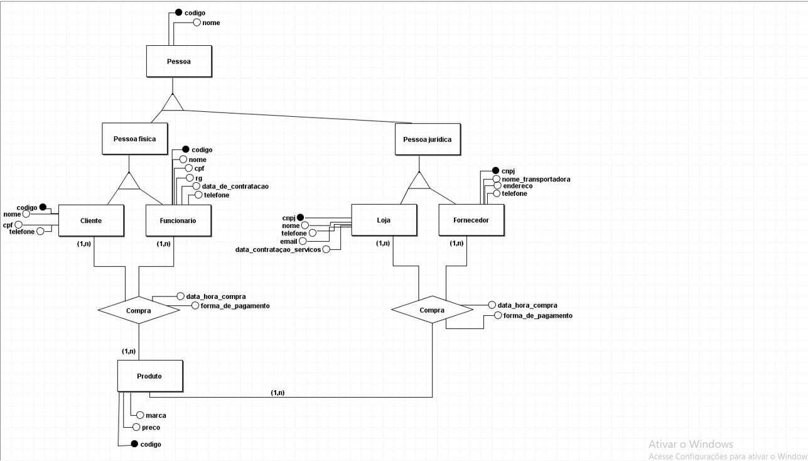

# TRABALHO 01:  Título do Trabalho
Trabalho desenvolvido durante a disciplina de Banco de dados

# Sumário

### 1. COMPONENTES 
Integrantes do grupo 
primeiro_componente_do_grupo:fellipywagmacker123@gmail.com 
segundo_componente_do_grupo:dara.botecchia22@gmail.com 
terceiro_componente_do_grupo:evelynpo59@gmail.com 

### 2.INTRODUÇÃO E MOTIVAÇÃO 
Este documento contém a especificação do projeto do banco de dados <nome do projeto> 
 e motivação da escolha realizada.  

> A loja visa colaborar com o desenvolvimento socioprofissional dos seus colaboradores e acima da venda de produtos, entregar experiências diferenciadas para o seu público alvo. O sistema da loja tem como objetivo gerenciar todos os processos da organização, bem como controlar e gerar relatórios analíticos. Para que seja efetuado tal gerenciamento é realizado o cadastro de  pessoa física como por exemplo: cliente, funcionário, compra, produto e Pessoa jurídica: loja, fornecedores, compra, produto. De acordo com o gerenciamento nada sai e entra da loja sem que seja processado pelo sistema, desde mercadorias, valores, impostos, folhas de pagamento, aquisição de bens, investimentos, receita e despesas. O sistema promove uma gestão mais assertiva e confiável.
 

### 3.MINI-MUNDO 

Descrever o mini-mundo! (Não deve ser maior do que 30 linhas, se necessário resumir para justar)  
Entrevista com o usuário e identificação dos requisitos.(quando for o caso de sistemas com cliente  real) 
Descrição textual das regras de negócio definidas como um  subconjunto do mundo real 
cujos elementos são propriedades que desejamos incluir, processar, armazenar, 
gerenciar, atualizar, e que descrevem a proposta/solução a ser desenvolvida.

> Um sistema gerencia várias LOJAS, para uma melhor organização foram distribuídos dados de PESSOA FISICA e PESSOA JURIDICA. Portanto, em PESSOA FISICA  foram armazenados as informações das seguintes entidades: CLIENTE ( codigo, nome, cpf, telefone), FUNCIONARIO ( codigo, nome, cpf, rg, data_de_contratacao, telefone), associados ao  o relacionamento COMPRA ( data_hora_compra, forma_de_pagamento) e conectado a entidade PRODUTO( marca, preco, codigo). Portanto, um cliente pode ser atendido por um ou vários funcionários e o funcionário pode atender um ou vários clientes, podendo comprar um ou vários produtos. Seguimos agora com as informações armazenadas em PESSOA JURIDICA com as seguintes entidades: LOJA ( CNPJ, nome, telefone, email, data_contratacao_servico), FORNECEDOR (CNPJ, nome_transportadora, endereço, telefone), associados ao  o relacionamento COMPRA ( data_hora_compra, forma_de_pagamento) e conectado a entidade PRODUTO( marca, preco, codigo). Sendo assim, uma loja pode ter um ou vários fornecedores e os fornecedores podem fornecer para uma ou várias lojas, podendo comprar um ou vários produtos. 

   

### 4.PERGUNTAS A SEREM RESPONDIDAS E TABELA DE DADOS 
#### 4.1 QUAIS PERGUNTAS PODEM SER RESPONDIDAS COM O SISTEMA PROPOSTO?
    a) O sistema proposto poderá fornecer quais tipos de relatórios e informaçes? 
    
    Além de gerenciar todos os processos realizados na empresa o sistema irá gerar relatórios analíticos, trazendo informações  de Pessoa física, Pessoa jurídica, dados de seus produtos e informações sobre vendas realizadas. Portanto, o sistema proposto contribui com a organização e armazenagem de informações da empresa.
    
    b) Crie uma lista com os 5 principais relatórios que poderão ser obtidos por meio do sistema proposto!
    
 . Pessoa, sendo ela física ou jurídica. 
 . Loja: CNPJ, nome, telefone, email, data de contratação de serviços da nossa empresa. 
 . Dados de seus funcionários: Código, nome, cpf, data de contratação, telefone. 
 . Informações de seus fornecedores: CNPJ, nome da transportadora, endereço, telefone. 
 . Relatórios de vendas realizadas pelas lojas: Data e hora da compra, forma de pagamento, produto. 

    
> A Empresa DevCom precisa inicialmente dos seguintes relatórios:
* Relatório que mostre o nome de cada supervisor(a) e a quantidade de empregados supervisionados.
* Relatório relativo aos os supervisores e supervisionados. O resultado deve conter o nome do supervisor e nome do supervisionado além da quantidade total de horas que cada supervisionado tem alocada aos projetos existentes na empresa.
* Relatorio que mostre para cada linha obtida o nome do departamento, o valor individual de cada salario existente no  departamento e a média geral de salarios dentre todos os empregados. Os resultados devem ser apresentados ordenados por departamento.
* Relatório que mostre as informações relacionadas a todos empregados de empresa (sem excluir ninguém). As linhas resultantes devem conter informações sobre: rg, nome, salario do empregado, data de início do salario atual, nomes dos projetos que participa, quantidade de horas e localização nos referidos projetos, numero e nome dos departamentos aos quais está alocado, informações do historico de salário como inicio, fim, e valores de salarios antigos que foram inclusos na referida tabela (caso possuam informações na mesma), além de todas informações relativas aos dependentes. 
>> ##### Observações:   a) perceba que este relatório pode conter linhas com alguns dados repetidos (mas não todos).    b) para os empregados que não possuirem alguma destas informações o valor no registro deve aparecer sem informação/nulo. 
* Relatório que obtenha a frequencia absoluta e frequencia relativa da quantidade de cpfs únicos no relatório anterior. Apresente os resultados ordenados de forma decrescente pela frequencia relativa.

 ### 5.MODELO CONCEITUAL 
    A) Utilizar a Notação adequada (Preferencialmente utilizar o BR Modelo 3)
    B) O mínimo de entidades do modelo conceitual pare este trabalho será igual a 5 e o Máximo 7.
        * informe quais são as 3 principais entidades do sistema em densenvolvimento (se houverem mais de 3 entidades, pense na importância da entidade para o sistema)       
    C) Principais fluxos de informação/entidades do sistema (mínimo 3).  Dica: normalmente estes fluxos estão associados as tabelas que conterão maior quantidade de dados 
    D) Qualidade e Clareza
        Garantir que a semântica dos atributos seja clara no esquema (nomes coerentes com os dados).
        Criar o esquema de forma a garantir a redução de informação redundante, possibilidade de valores null, 
        e tuplas falsas (Aplicar os conceitos de normalização abordados).   
        

    
    
        
    
#### 5.1 Validação do Modelo Conceitual
    [Grupo01]: [ ]
    [Grupo02]: [ ]

#### 5.2 Descrição dos dados 
    
Pessoa: Entidade na qual contém uma associação entre Pessoa Física e Pessoa Jurídica. 
Pessoa Física: Inclui informações sobre cliente e funcionário.  
Pessoa Jurídica: Inclui informações sobre Loja e Fornecedor. 
Cliente: Campo que abrange dados sobre os clientes cadastrados. 
Funcionário: Campo que abrange dados sobre os funcionários. 
Compra: Contém dados sobre as compras realizadas. 
Produto: Dados sobre os produtos. 
Loja: Inclui informações sobre a loja. 
Fornecedor: Campo que armazena informações sobre os fornecedores. 

### 6	MODELO LÓGICO 
        a) inclusão do esquema lógico do banco de dados
        b) verificação de correspondencia com o modelo conceitual 

### 7	MODELO FÍSICO 
        a) inclusão das instruções de criacão das estruturas em SQL/DDL 
	
CREATE TABLE LOJA(
	cnpj integer PRIMARY KEY,
	nome varchar(150),
	telefone integer,
	email varchar(150)
);

CREATE TABLE FORNECEDOR(
	cnpj integer PRIMARY KEY,
	nome_transportadora varchar(100),
	telefone integer,
	cep integer,
	numero integer,
	rua varchar(25),
	bairro varchar(30)
	
);

CREATE TABLE LOJA_FORNECEDOR(
	FK_FORNECEDOR_cnpj integer,  
	FK_LOJA_cnpj integer,
	
	FOREIGN KEY (FK_FORNECEDOR_cnpj)
	REFERENCES FORNECEDOR(cnpj),
	FOREIGN KEY (FK_LOJA_cnpj) 
	REFERENCES LOJA(cnpj)
);

CREATE TABLE FUNCIONARIO(
	codigo integer PRIMARY KEY,
	nome varchar(170),
	cpf integer,
	rg integer,
	data_contratacao date,
	telefone integer
);

CREATE TABLE PRODUTO(
	codigo integer PRIMARY KEY,
	marca varchar(70),
	preco float
);

CREATE TABLE VENDE(
	FK_FUNCIONARIO_codigo integer, 
	FK_PRODUTO_codigo integer, 
	forma_pagamento varchar(50),
	data_hora_venda timestamp,
	
	FOREIGN KEY (FK_FUNCIONARIO_codigo)
	REFERENCES FUNCIONARIO(codigo),
	FOREIGN KEY (FK_PRODUTO_codigo)
	REFERENCES PRODUTO(codigo)
	
);

        
       
### 8	INSERT APLICADO NAS TABELAS DO BANCO DE DADOS 
        a) inclusão das instruções de inserção dos dados nas tabelas criadas pelo script de modelo físico
        (Drop para exclusão de tabelas + create definição de para tabelas e estruturas de dados + insert para dados a serem inseridos)
        b) Criar um novo banco de dados para testar a restauracao 
        (em caso de falha na restauração o grupo não pontuará neste quesito)
        c) formato .SQL

### 9	TABELAS E PRINCIPAIS CONSULTAS 
    OBS: Usar o colab para apresentar os resultados que devem incluir as instruções SQL + resultados em forma de tabela. 
#### 9.1	CONSULTAS DAS TABELAS COM TODOS OS DADOS INSERIDOS (Todas)  

># Marco de Entrega 01: Do item 1 até o item 9.1 

#### 9.2	CONSULTAS DAS TABELAS COM FILTROS WHERE (Mínimo 4) 
#### 9.3	CONSULTAS QUE USAM OPERADORES LÓGICOS, ARITMÉTICOS E TABELAS OU CAMPOS RENOMEADOS (Mínimo 11)
    a) Criar 5 consultas que envolvam os operadores lógicos AND, OR e Not
    b) Criar no mínimo 3 consultas com operadores aritméticos 
    c) Criar no mínimo 3 consultas com operação de renomear nomes de campos ou tabelas

#### 9.4	CONSULTAS QUE USAM OPERADORES LIKE E DATAS (Mínimo 12)  
    a) Criar outras 5 consultas que envolvam like ou ilike
    b) Criar uma consulta para cada tipo de função data apresentada.

#### 9.5	INSTRUÇÕES APLICANDO ATUALIZAÇÃO E EXCLUSÃO DE DADOS (Mínimo 6) 
    a) Criar minimo 3 de exclusão
    b) Criar minimo 3 de atualização

#### 9.6	CONSULTAS COM INNER JOIN E ORDER BY (Mínimo 6) 
    a) Uma junção que envolva todas as tabelas possuindo no mínimo 2 registros no resultado
    b) Outras junções que o grupo considere como sendo as de principal importância para o trabalho

#### 9.7	CONSULTAS COM GROUP BY E FUNÇÕES DE AGRUPAMENTO (Mínimo 6) 
    a) Criar minimo 2 envolvendo algum tipo de junção

#### 9.8	CONSULTAS COM LEFT, RIGHT E FULL JOIN (Mínimo 4) 
    a) Criar minimo 1 de cada tipo

#### 9.9	CONSULTAS COM SELF JOIN E VIEW (Mínimo 6) 
        a) Uma junção que envolva Self Join (caso não ocorra na base justificar e substituir por uma view)
        b) Outras junções com views que o grupo considere como sendo de relevante importância para o trabalho

#### 9.10	SUBCONSULTAS (Mínimo 4) 
     a) Criar minimo 1 envolvendo GROUP BY
     b) Criar minimo 1 envolvendo algum tipo de junção

># Marco de Entrega 02: Do item 9.2 até o ítem 9.10 

### 10 RELATÓRIOS E GRÁFICOS (Usar template disponibilizado)
[Template de relatórios](https://github.com/discipbdint/public_samples/blob/main/BD_Exemplo_Relatorios_Empresa_VA.ipynb "Template relatórios")

#### a) análises e resultados provenientes do banco de dados desenvolvido (usar modelo disponível)
#### b) link com exemplo de relatórios será disponiblizado pelo professor no AVA
#### OBS: Esta é uma atividade de grande relevância no contexto do trabalho. Mantenha o foco nos 5 principais relatórios/resultados visando obter o melhor resultado possível.

    

### 11	AJUSTES DA DOCUMENTAÇÃO, CRIAÇÃO DOS SLIDES E VÍDEO PARA APRESENTAÇAO FINAL  

#### a) Modelo (pecha kucha) 
#### b) Tempo de apresentação 6:40 

># Marco de Entrega 03: Itens 10 e 11 
 
 
  

### 12 FORMATACAO NO GIT:  
https://help.github.com/articles/basic-writing-and-formatting-syntax/
<comentario no git>
    
##### About Formatting
    https://help.github.com/articles/about-writing-and-formatting-on-github/
    
##### Basic Formatting in Git
    
    https://help.github.com/articles/basic-writing-and-formatting-syntax/#referencing-issues-and-pull-requests
    
    
##### Working with advanced formatting
    https://help.github.com/articles/working-with-advanced-formatting/
#### Mastering Markdown
    https://guides.github.com/features/mastering-markdown/

    
### OBSERVAÇÕES IMPORTANTES

#### Todos os arquivos que fazem parte do projeto (Imagens, pdfs, arquivos fonte, etc..), devem estar presentes no GIT. Os arquivos do projeto vigente não devem ser armazenados em quaisquer outras plataformas.
1. <strong>Caso existam arquivos com conteúdos sigilosos<strong>, comunicar o professor que definirá em conjunto com o grupo a melhor forma de armazenamento do arquivo.

#### Todos os grupos deverão fazer Fork deste repositório e dar permissões administrativas ao usuário do git "profmoisesomena", para acompanhamento do trabalho.

#### Os usuários criados no GIT devem possuir o nome de identificação do aluno (não serão aceitos nomes como Eu123, meuprojeto, pro456, etc). Em caso de dúvida comunicar o professor.

Link para BrModelo: 
http://www.sis4.com/brModelo/download.html
 

Link para curso de GIT 

